# Mind Flip - Match the animal

<a name="Top"></a>


#### **Live website**

https://ellisbale.github.io/MindFlip/


## Contents


1. [UX](#UX)

2. [Design](#Design)

3. [Technologies](#Technologies)

4. [Features](#Features)

5. [Testing](#Testing)
    - [HTML, CSS and JS valdiation](#Validation)
    - [Browser Compatibility](#Browser)
    - [Bugs & fixes](#Bugs)
    - [Functional Testing](#functional)
    - [User story testing](#Userstory)

6. [Deployment](#Deployment)

7. [Credits](#Credits)

<a id="UX"></a>

## 1. **UX**


### **Project purpose** ####

To have fun playing a game while improving brain function through memory game. I chose to have animal images which gave me plenty of images to add to the cards.


### **User goals** ####

The users goals are to have fun playing the game while improving their memory. To do this there is different levels which get harder to complete so that the user doesn't get bored.


### **Site owner goals** ####

The aim of this website is to have fun playing a game made with javascript. The game is a memory card game which you can have fun playing while also offering several cognitive benefits. The website will allow users to have fun while improving their memory. I want users to be able to improve their hand and eye coordination, memory enhancement, cognitive development and mental agility such as processing speed.


### **Target Audience**

The target audience for the game are casual players, kids and elderly.


### **User Journey**

- Entry point: The user lands on homepage with navbar and gameboard.

- Instructions: The "How to play" button opens a modal explaining how to play the game with text and gifs.

- Gameplay flow:
    1. User starts on level 1.

    2. Game grid increases/decreases in size based on level.

    3. User flips cards to find a matching pair.

    4. Visual feedback on cards when user matches or mismatches.

    5. User advances to next level when completed and clicked on with "Next level" button.


### **Interaction feedback**

- Cards that are flipped show animation.

- Cards that are matched are removed from the board and hidden.

- Result message updates when finishing level.

- Hover effects such as the fontAwesome questionmark icon adds interaction.

- Cards scale up slightly when hovered over and change colour.

### **Responsive Design**

The website adapts to what device the user is using. For adapting screen sizes I used bootstrap. Bootstrap includes flexible grids that is based on a 12 column layout. This allows containers to adapt to different screen sizes. For extra responsive design I used @media max-width in my CSS file so that I could adapt the grid layout that is created in my JS file. I used this because I didn't add the grid gameboard layout with bootstrap.


### Research

#### **Reviewing other websites**

I took inspiration from the other websites below. I added parts to my website such as moves, levels and next level button. I also wanted to see how they adapt their games to smaller screen sizes such as on mobile. To test this I used chrome dev tools to change the layout of my screen. The other website used flexbox and media query in CSS to adapt to smaller screen sizes which can help with my project.

**Websites I visited**

[Helpfullgames](https://www.helpfulgames.com/subjects/brain-training/memory.html)

[CodePen](https://codepen.io/zerospree/full/bNWbvW)

<hr>

<a id="Design"></a>

## 2. **Design**


### **Wireframes**

I used Balsamiq Wireframes to help structure the wireframes before and during the design of the website. This helped me plan the design of the website by helping me apply the layout and the navigation. Using the software is good for designing layouts on different devices so that I can implement them later on.


<details> 
<summary> Mobile </summary>

 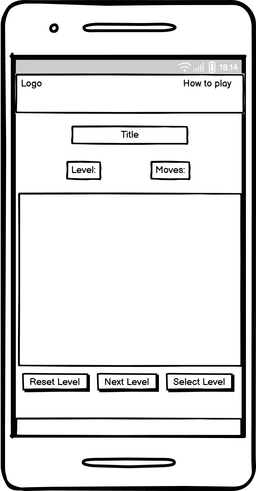
</details>
<br>
<details>
<summary> Tablet </summary>

 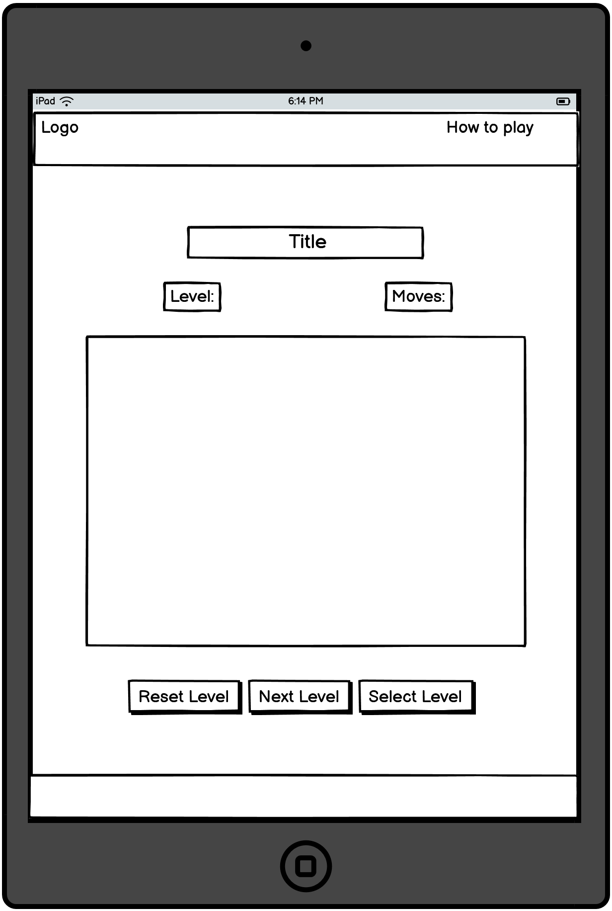
</details>
<br>
<details>
<summary> Desktop </summary>

 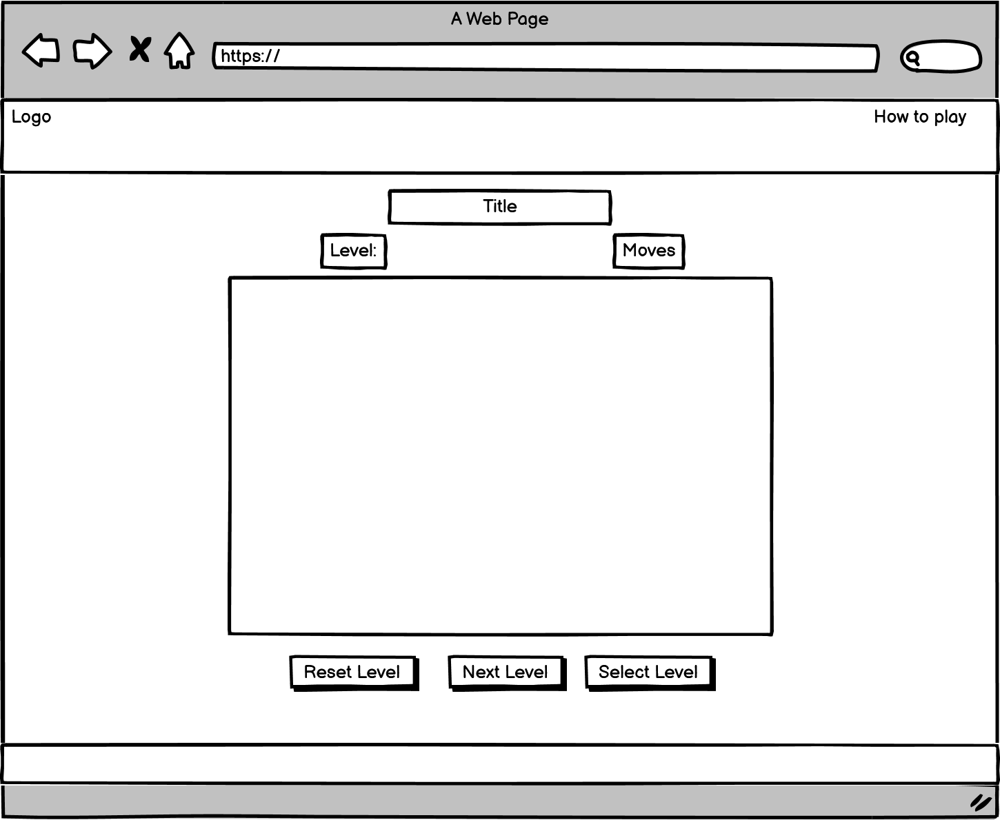
</details>


### Website Structure

The website contains 1 page for the game and a modal that pops up when clicked on. I was originally going to add a seperate page for my "how to play" page but was recommended by student mentor to add a modal. Adding the modal instead of another html page allows the user to keep their game progress, otherwise the extra page would have refreshed when they returned back to the homepage.


### Colours

For the navbar I used 2fd073 which is a type of green. I picked this colour for the navbar because I felt like it was visually appealing and great for a casual game. The black text on the navbar makes for high readability with the green. It helps with visually impaired users because of the good contrast score from https://imagecolorpicker.com/color-code/2fd073. The second colour I used for this website is a type of dark gray (#1E1E1E) for the body. I think this colour is easy on the eyes as well as going well with the navbar colour. The background is meant to be subtle and not distract the user when playing.

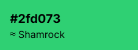  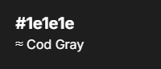

### Fonts

For the fonts I imported some fonts from GoogleFonts. For headings I used Rubik Mono One which I felt goes well with the website category memory games also giving it a playfull feel to the site. For text in the body I used Work Sans because I was looking for something minimal so that the text didn't distract the user for the main point of the website which is the game. For buttons I went with system-ui -apple-system, sans serif. For game level and moves element I used DyanaPuff as it looks playful for casual gaming.

<hr>


<a id="Technologies"></a>

## 3. **Technologies**


### Languages and tools used in this project:

* HTML - The main language I use for this website is HTML which is the foundation and the structure of the website.

* CSS - This language I also mainly used to style my html elements to make them look more visually appealing to users that navigate the website.

* Javascript - This makes pages more interactive and dynamic. 

* Lighthouse - This is used to test websites performance during and at the end of devlopment.

* Wave - Wave is used for testing the websites accessibility.

* W3C - This is used for testing my code validation.

* Git - This is used for committing changes which is then pushed to Github to be stored.

* Github - Github allows me to host my website on as well as my files.

* Balsamiq - I used this software to create wireframes before development and changing it during development.

* Favicon.io - This website generates favicons.

* VS Code - This software was used to code my website during this project.

* FontAwesome - This was used to add icons to my website for visuals.

<hr>


## 4. **Features** 

<a id="Features"></a>

### **Whole site**

#### **Nav bar**

- The navbar was made with bootstrap to save time coding instead of adding flex in CSS. 

- Contains a modal top left which can open when clicking on it. This contains game instructions to help the user to understand on how to play the game.

- Contains the websites logo in the top left.

- Background of navbar as a SVG design from [svgbackgrounds.com](https://www.svgbackgrounds.com/set/free-svg-backgrounds-and-patterns/).

- Includes a hover effect when hovering over "how to play".


<details>

<summary> Screenshots </summary>
<br>

**Mobile**

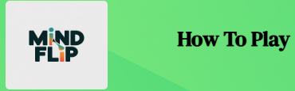


**Tablet**

 

**Desktop** 

 


</details>


#### **Footer**

- Hover effect on github FontAwesome logo

- SVG design link

- Responsive


<details>
<summary> Footer Screenshot </summary>
<br>

**Mobile** 

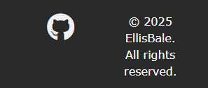 

**Tablet** 

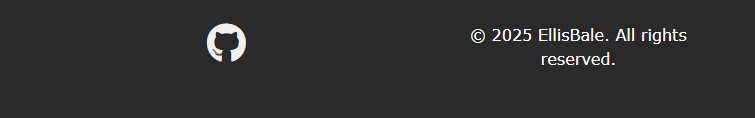 

**Desktop** 

 

</details>


### Home page


<details>
<summary>Screenshot </summary>
<br>

**Mobile & Tablet**

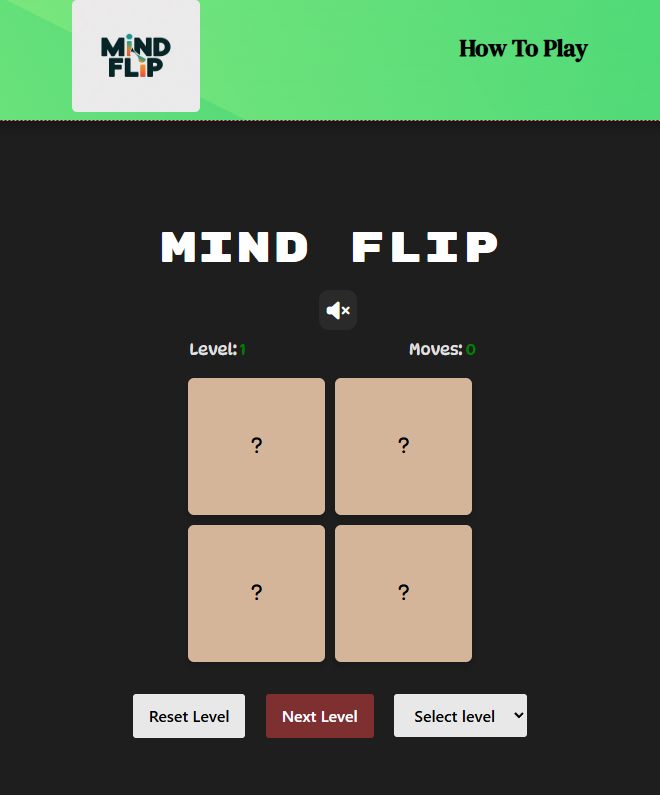

**Desktop**


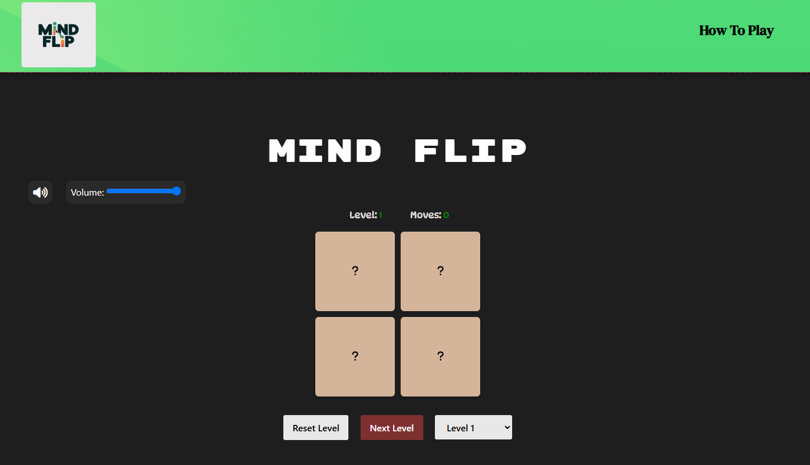


</details>


#### **Gameboard grid**

- Grid increases cards when going up in levels to make the game harder for the user.

- Cards flipping have smooth transitions.

- Cards have hover effects that, scale up in size, change colour and includes a fontAwesome question mark icon that bounces. These effects make the grid more interactive and better visually for the user.

- Responsive cards and gridsize for smaller devices.

- Hides cards from grid when matching.

<details> 

<summary> Gameboard grid gif </summary>

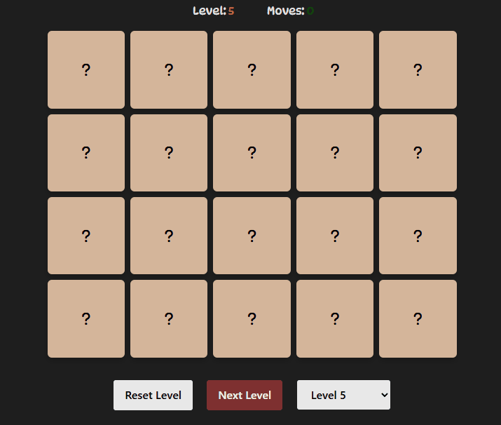 

</details>


#### **Volume control**

- Volume slider

    - Background music that allows players to control the audio volume with slider.
    - Volume slider for background music is removed on tablet and mobile as user can turn the volume down with device.

- Mute/unmute 

    - Mutes/unmutes background music by pausing it.
    - Volume mutes/unmutes when tabbing in and out.


<details>
    
<summary> Volume controls gif </summary>    
    
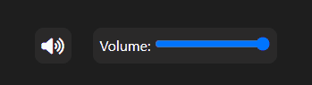 
    
</details>


#### **How to play modal**

- A pop-up overlay that shows the user instructions of how to play the game.

- Includes gif video on each instruction.

- Allow user to read instructions and game doesn't refresh.


<details> 

<summary> How to play screenshot </summary>

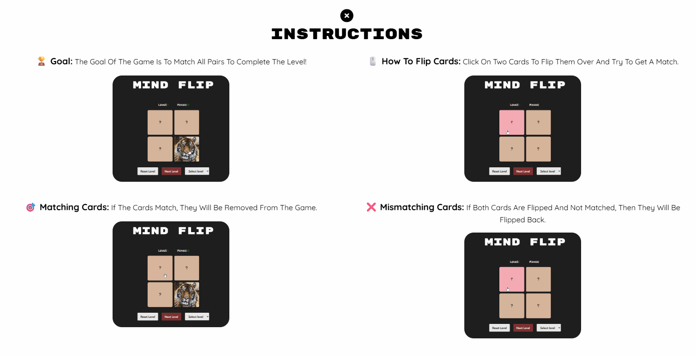 


</details>

#### **Reset button**

- Allows user to reset level by reshuffling cards and resetting moves.

- Helps user reset their game if they are aiming for a certain amount of moves.

<details> 

<summary> Reset button gif </summary>

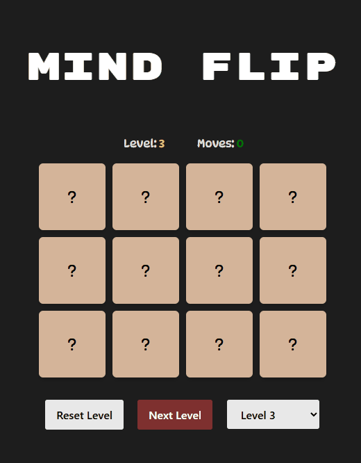 

</details>


#### **Next level button**

- Only functions when user has completed level.

- Button is red when not in function during the game, green with a pulsing animation when user matches all cards.

- Sends user to next level.

<details> 

<summary> Next level button gif </summary>

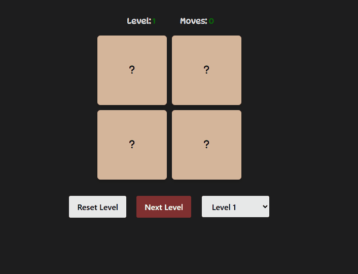 

</details>


#### **Level select**

- Button that opens options for users to select level 1 to 6. This allows the user to go back to previous levels.

- Allows users to skip to harder levels.

<details> 

<summary> Level select button gif </summary>

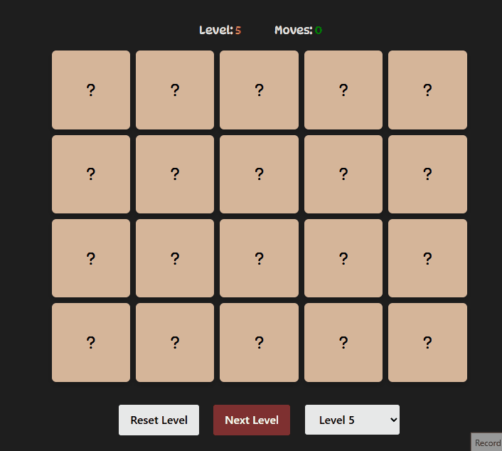 

</details>


<hr>

<a id="Testing"></a>

## 5. **Testing & Bugs**  

<a id="Validation"></a>

### **HTML validation**

To test my html code validation I used the [W3C HTML Validator](https://validator.w3.org/)  by direct input. This let's me see what errors I have such as unwanted elements.

<details>
<summary> index.html </summary>

No issues when testing.

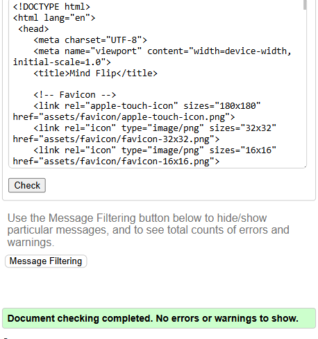


</details>


### **CSS validation**

I copied my style.css code into the [W3C CSS Validator](https://jigsaw.w3.org/css-validator/) and this will show me if I have any coding errors in my css file.

<details>
<summary> style.css </summary>


</details>


### **JSLint**

I copied my script.js into [JSLint](https://www.jslint.com/) and this will check if the code complies with coding rules. At first I had mainly spacing and 80 characters or more on a line which I quickly fixed.

<details>
<summary> script.js </summary>
<br>

**Before:**

Issue with arrow function being too complex.

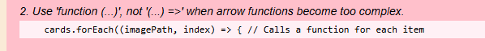 


**Fix:**

Removed it from the startlevel function and added it as its own.

`function createCards(cards) { 
    cards.forEach(function(imagePath, index) {
        const card = document.createElement("div");
        card.classList.add("card");
        adjustGridSize();
        card.innerHTML =
        <i class="fa-solid fa-question fa-lg bounce-on-hover"></i>;
        card.dataset.index = index;
        card.dataset.imagePath = imagePath;
        card.addEventListener("click", function() {
        flipCard(card);
        });
        gameBoard.appendChild(card);
    });
}`

</details>


<hr>

### **Accessibility**

I used the Wave accessibilty evaluation tool downloaded from the chrome web store. This is a tool that helps make my site more accessible to users with disabilities. This tool helped me add alt and arial labels to elements on the page.

<details> 

<summary> Wave accessibilty test </summary>

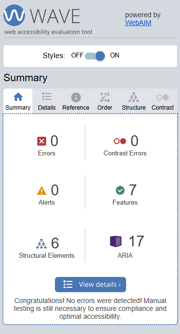 

</details>


### Accessibility considerations

- Buttons include aria-labels and alt on images.

- Semantics HTML: Corect use of HTML semantic elements such as headings, nav and footer.

- Colour on current level text to show level status with contrast being good.


### **Testing on different devices**

I tested different devices through Google Chrome Developer Tools. This tool allowed me to adjust the size of the screen.

<a id="Browser"></a>

### **Browser Compatibility** 

Chrome - This is the browser I used to view my website during development.

Mozilla Firefox - This seems to work and look fine when viewing the website using this browser.

Microsoft Edge - This browser seems fine but a few minor differences such as the volume slider colour which is not a major issue for me or the user.


<hr>

<a id="Bugs"></a>

### **Bugs during development and fixes:**
<br>
<details>

<summary> Images not showing up from my array </summary>
<br>
I figured out the problem was to do with my images file path and simply forgot to add "assets" before "images/"/

**Before:**

`const images = ["images/fox.jpg","images/bear.jpg","images\bird.jpg","images\cat.jpg","images\dog.jpg","images/elephant.jpg","images/giraffe.jpg","images/gorilla.jpg",
"images/penguin.jpg","images/rabbit.jpg","images/tiger.jpg"];`

**Fix:**

`const images = ["assets/images/fox.jpg","assets/images/bear.jpg","assets/images/bird.jpg","assets/images/cat.jpg","assets/images/dog.jpg","assets/images/elephant.jpg",
"assets/images/giraffe.jpg","assets/images/gorilla.jpg", "assets/images/penguin.jpg","assets/images/rabbit.jpg","assets/images/tiger.jpg"];`
</details>

<br>

<details>

<summary> Unmatching cards not flipping back </summary>
<br>
I noticed when I was playing, the matching cards would work and be hidden but the unmatching cards would just stay flipped over and not turn back. I fixed this by having a look at my else statement in my checkMatch function and found a spelling mistake which I corrected.

**Before:**


`else {
        card1.classList.remove("flipped");
        card2.classList.rempve("flipped");
        card1.innerHTML = "?";
        card2.innerHTML = "?";
    }`


**Fix:**

 `else {
        card1.classList.remove("flipped");
        card2.classList.remove("flipped");
        card1.innerHTML = "?";
        card2.innerHTML = "?";
    }`

</details>

<br>
<details> 

<summary> Issues with grid layout </summary>
<br>
When resizing in chrome dev tools, the grid would be too big for smaller screen sizes causing layout issues. I realised that the grid template column was set to 100px, I fixed this by removing the 100px and adding in "1fr" which shrinks or grows automatically making it more responsive. In the CSS file I changed the gameboard class and added in grid-template-columns to repeat(4, 1fr). I made the card class have a aspect-ratio of 1/1 which makes the width and height the same.


**Before:**

  JS: 

`  const [cols, rows] = levels[level - 1];
   const totalCards = cols * rows;
   const numPair = totalCards / 2;
   gameBoard.style.gridTemplateColumns = `repeat(${cols}, 100px)`;
   let selectedImages = images.slice(0, numPair);
   let cards = [...selectedImages, ...selectedImages];`

    CSS: 

    `.card {

    width: 100px;
    height: 100px;
    background-color: #D5B59A;
    display: flex;
    align-items: center; }`


  **Fix:**


  JS: 

  ` const [cols, rows] = levels[level - 1];
   const totalCards = cols * rows;
   const numPair = totalCards / 2;
   gameBoard.style.gridTemplateColumns = `repeat(${cols}, 1fr)`;
   let selectedImages = images.slice(0, numPair);
   let cards = [...selectedImages, ...selectedImages];`

   CSS:

    `.card {
    aspect-ratio: 1/1;
    width: 100%;  
    width: 100px;
    height: 100px;
    background-color: #D5B59A;
    display: flex;
    align-items: center; } 
    
    .game-board {
    display: grid;
    justify-content: center;
    gap: 10px;
   margin-top: 20px;  
   grid-template-columns: repeat(4, 1fr);
   max-width: 600px;
   margin: 0 auto;
}`

</details>
<br>
<details> 

<summary> Grid issues on screens widths 768px and below </summary>
<br>

I was having issues with the gameboard not being in the center of the page. The cards and gameboard would stay to the left when using chrome dev tools and the right would have more space. I fixed this by adding media queries for these screen sizes to fix the positioning.

**Fix**

`@media (max-width: 768px) {
    .game-board {
        grid-template-columns: repeat(2, 1fr);
        margin-left: 10px;
        margin-right: 10px;
        max-width: 100%;
    }
}`

`@media (max-width: 480px) {
    .game-board {
        grid-template-columns: repeat(2, 1fr);
    }
}` 

</details>
<br>

<details>

<summary> Images not randomizing </summary>
<br>

When playing I noticed that the images would be the same for each level such as when playing level 1 and 2. I noticed in my images array that the order of the images they start in would be in the same level as the game. For example, the fox and bear would all ways be at the start of level 1. To fix this I decided to add a shuffle to the images.

**Fix**

`let shuffleImages = [...images];
   shuffle(shuffleImages);
   let selectedImages = shuffleImages.slice(0, numPair);
   let cards = [...selectedImages, ...selectedImages];`


 </details>
<br>

<details>

<summary> Unmuting the button won't work when tabbed out and in again </summary>
<br>

I noticed there was a bug with my mute button when I tabbed out and in again. This bug would only occur when I had the background music on mute to begin then tabbing out and in again to try to unmute it. I fixed this by adding a extra if statement to my mute button function.

**Fix**

` if(!isMuted && backgroundMusic.paused) { // Allows music to resume if the user had muted it, then tabbed out.
        backgroundMusic.play().catch(err => {
            console.warn("Playback blocked on unmute:", err);
        });
    } `


 </details>


<br>

<details>

<summary> Background music still playing when tabbed out on mobile </summary>
<br>

When I completed the audio issue when tabbed out for desktop. I realised on my github website on my mobile that the background music was still playing when tabbed out. I fixed this by adding "window.addEventListener("pagehide")" this stops the background music from playing when tabbed out on mobile.


**Fix**

`window.addEventListener("pagehide", () => { // Fixes issue for background music playing when tabbed out on mobile
    backgroundMusic.pause();
});`


 </details>
<hr>

<a id="Functional"></a>

### **Functional Testing**

#### Interactables

- Card flips
    - Card flips
    - Cards unmatch and flip back
    - Cards match and are hidden
    - Matching all pairs turns next level button to green and functional
    - User gets message when matching all pairs

- Reset button
    - Resets game by reshuffling images
    - Resets moves number back to 0
    - Changes next level button back to red and non-functional by starting level again

- How to play modal
    - Modal pops up when clicked on
    - Modal closes when user clicks of it or presses X
    - Includes game instuctions


- Next level button
    - Button colour is red when user hasn't completed level
    - Button functionality doesn't work when user hasn't completed level
    - Changes colour to green when user completes level
    - Function added when level complete
    - When level is completed, sends user to next level 

- Level select button
    - Lets user select levels 1/6
    - Grid size change depending on the level

- Volume controls
    - User can change increase/decrease background audio with slider
    - Stops playing when user is tabbed out
    - Plays again when user tabs back in

- Mute/unmute button
    - Pause background music
    - Unpause background music

    ### **Manual Testing file**

    ### [Testing file](./docs/testing/functionalTesting.md)

<hr>

<a id="Userstory"></a>

### **User story testing:**


| User Story                                                                                                                           | Testing                                                                                                                                                                                                                       |
|--------------------------------------------------------------------------------------------------------------------------------------|-------------------------------------------------------------------------------------------------------------------------------------------------------------------------------------------------------------------------------|
| As a user, I like to have harder and more levels so I don't get bored of the same level.                                             | Added in a total of 6 levels which adds more cards onto the grid for each level  the user completes so it get's more difficult for user.                                                                                      |
| As a user, I want to know how many moves I am on  so that I can improve the next time I play.                                        | Added in a moves count for each level at the top left of the gameboard grid so user  can see how they are doing during and after the game.                                                                                    |
| As a user, I want to be able to replay the same  level so that I can improve my moves for that level.                                | Added in a reset level button function that is at the bottom left of the gameboard  grid. The reset button also reshuffles cards on the grid as well as resetting moves.                                                      |
| As a user, I want a next level button so that  I can move onto the next level.                                                       | Added in a next level button that only functions when user completes level. When  user completes level the button turns green with a pulsing animation to let the user know that the button functions.                        |
| As a user, I would like to have some music in the background when playing as well as volume controls to mute or turn the music down. | Added in background music with a mute/unmute button along with a volume slider so the user can control the audio level without having to on their device.                                                                     |
| As a new user, I would like to learn how to play the game.                                                                           | Added in instructions modal that doesn't effect the game while they play so the user can view the instructions during any level. The modal includes gif video's for each instruction to give the user a better understanding. |
| As a user, I want smooth transitions when I flip the cards.                                                                          | Added in card hover effect including colour change, transform and FontAwesome bounce on hover animation.                                                                                                                      |


<hr>

<a id="Deployment"></a>

## 6. **Deployment**

### **Github**

### Version Control

The site was created using the Visual Studio code editor and pushed to github to the remote repository.

The following git commands were used throughout development to push code to the remote repo:

```git add <file>``` - This command was used to add the file(s) to the staging area before they are committed.

```git commit -m “commit message”``` - This command was used to commit changes to the local repository queue ready for the final step.

```git push``` - This command was used to push all committed code to the remote repository on github.

### Deployment to Github Pages

- The site was deployed to GitHub pages. The steps to deploy are as follows: 
  - In the GitHub repository, navigate to the Settings tab 
  - From the menu on left select 'Pages'
  - From the source section drop-down menu, select the Branch: main
  - Click 'Save'
  - A live link will be displayed in a green banner when published successfully. 

The live link can be found here - 

### Clone the Repository Code Locally

Navigate to the GitHub Repository you want to clone to use locally:

- Click on the code drop down button
- Click on HTTPS
- Copy the repository link to the clipboard
- Open your IDE of choice (git must be installed for the next steps)
- Type git clone copied-git-url into the IDE terminal

The project will now of been cloned on your local machine for use.

<hr>

<a id="Credits"></a>

## 7. **Credits**

What I used to shuffle my array (https://www.youtube.com/watch?v=FGAUekwri1Q&ab_channel=BroCode/)

How to play JavaScript modal (https://www.w3schools.com/howto/tryit.asp?filename=tryhow_css_modal)

Helped with my coding (https://www.w3schools.com/js/default.asp) and (https://developer.mozilla.org/en-US/docs/Web/JavaScript)

SVG design (https://www.svgbackgrounds.com/set/free-svg-backgrounds-and-patterns/)

Audio volume control (https://developer.mozilla.org/en-US/docs/Web/HTML/Reference/Elements/input/range)

Background music (https://pixabay.com/music/beautiful-plays-just-relax-11157/)

visibility change event (https://developer.mozilla.org/en-US/docs/Web/API/Page_Visibility_API#pausing_audio_on_page_hide)


**Images used:**

- [Cat](https://unsplash.com/photos/a-close-up-of-a-cat-on-a-table-aZHOOdE9bjQ) By Roman Hnydin

- [Penguin](https://unsplash.com/photos/a-penguin-walking-in-the-snow-on-a-beach-UOd9hVAzm5A) By TC Photography

- [Dog](https://unsplash.com/photos/black-dog-m-Doa-GTrUw) By David Lezcano

- [Rabbit](https://unsplash.com/photos/white-rabbit-on-green-grass-u_kMWN-BWyU) By Satyabratasm

- [Giraffe](https://unsplash.com/photos/brown-and-beige-giraffe-NEJcmvLFcws) By Sian Cooper

- [Monkey](https://unsplash.com/photos/a-close-up-of-a-monkey-on-a-tree-branch-yc-KMlo4afE) By Manoj Seenivasan

- [Cow](https://unsplash.com/photos/brown-and-white-cow-on-green-grass-field-during-daytime-LtC0qgqNJJY) By laura adai

- [Bear](https://unsplash.com/photos/brown-bear-near-grass-field-kZ8dyUT0h30) By Jessica Weiller

- [Fox](https://unsplash.com/photos/a-red-fox-poses-staring-directly-into-the-camera-Powgsxla7Es) By Cody Boileau

- [Bird](https://unsplash.com/photos/brown-and-orange-bird-on-brown-tree-branch-3lGi0BXJ1W0) By AARN GIRI

- [Elephant](https://unsplash.com/photos/gray-elephant-walking-beside-green-plants-during-daytime-9hSejnboeTY) By Zoë Reeve

- [Gorilla](https://unsplash.com/photos/a-black-and-white-photo-of-a-monkey-Q4epk-ghLD4) By William Warby

- [Tiger](https://unsplash.com/photos/photo-of-tigers-face-DfKZs6DOrw4) By Ian Robinson


## **Acknowledgements**

Gareth McGirr - Student mentor 

Code institute


[Back to Top](#top)