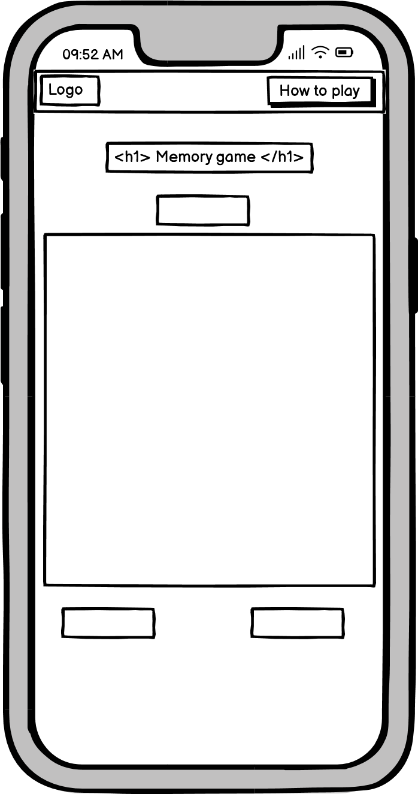
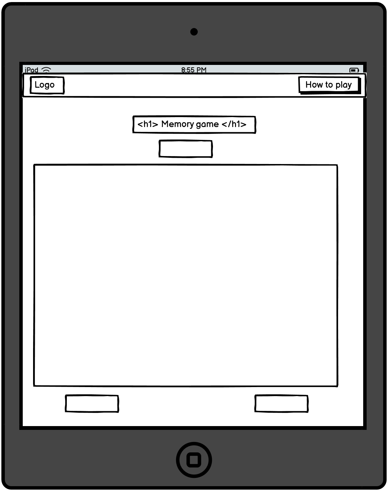

# Mind Flip - Match the animal


#### **Live website**

https://ellisbale.github.io/MindFlip/


## 1. UX


#### Project purpose 

To have fun playing a game while improving brain function through memory game. I chose to have animal images which gave me plenty of images to add to the cards.


#### **User goals** ####

The users goals are to have fun playing the game while improving their memory. To do this there is different levels which get harder to complete so that the user doesn't get bored.


#### **Site owner goals** ####

The aim of this website is to have fun playing a game made with javascript. The game is a memory card game which you can have fun playing while also offering several cognitive benefits. The website will allow users to have fun while improving their memory. I want users to be able to improve their hand and eye coordination, memory enhancement, cognitive development and mental agility such as processing speed.

## User stories

### User 

**User story 1: :**


**User story 2: :**


### Research


**Reviewing other websites**

I took inspiration from the other websites below. I added parts to my website such as moves, levels and next level button. I also wanted to see how they adapt their games to smaller screen sizes such as on mobile. To test this I used chrome dev tools to change the layout of my screen. The other website used flexbox and media query in CSS to adapt to smaller screen sizes which can help with my project.


**Websites I visited**

[Helpfullgames](https://www.helpfulgames.com/subjects/brain-training/memory.html)

[CodePen](https://codepen.io/zerospree/full/bNWbvW)

## 2. Design


### Wireframes

I used Balsamiq Wireframes to help structure the wireframes before and during the design of the website. This helped me plan the design of the website by helping me apply the layout and the navigation. Using the software is good for designing layouts on different devices so that I can implement them later on.

<details> 
<summary> Mobile </summary>

 
</details>
<br>
<details>
<summary> Tablet </summary>

 
</details>
<br>
<details>
<summary> Desktop </summary>

 

</details>


### Website Structure


### Colours


For the navbar I used 2fd073 which is a type of green. I picked this colour for the navbar because I felt like it was visually appealing and great for a casual game. The black text on the navbar makes for high readability with the green. It helps with visually impaired users because of the good contrast score from https://imagecolorpicker.com/color-code/2fd073. The second colour I used for this website is a type of dark gray (#1E1E1E) for the body. I think this colour is easy on the eyes as well as going well with the navbar colour. The background is meant to be subtle and not distract the user when playing.

  

### Fonts

For the fonts I imported some fonts from GoogleFonts. For headings I used Rubik Mono One which I felt goes well with the website category memory games also giving it a playfull feel to the site. For text in the body I used Work Sans because I was looking for something minimal so that the text didn't distract the user for the main point of the website which is the game.

## 3. Technologies


### Languages used in this project

* HTML - The main language I use for this website is HTML which is the foundation and the structure of the website.

* CSS - This language I also mainly used to style my html elements to make them look more visually appealing to users that navigate the website.

* Javascript - This makes pages more interactive and dynamic. 

### Tools used in the project


## 4. Features

### Whole site

#### **Nav bar**

The navbar is simple and has 1 link on the navbar for the "How to play" page which is located on the right. The website logo is to the left of the navbar and has a animation added with CSS that rotates the logo 360 degrees when hovered over. The rotation of the logo goes well with the website name which is "Mind Flip". I used Boostrap for the navbar container and a svg design for the background.

<details>

<summary> Screenshots </summary>

### Mobile and Tablet ###

 

### Desktop ### 


### Navbar Link Hover ###


</details>


#### Footer


<details>
<summary> Footer Screenshot </summary>

**Mobile** <br>


**Tablet** <br>


**Desktop** <br>


</details>


### Home page


<details>
<summary>Screenshot </summary>


</details>


### Mobile screenshots ###


### Tablet screenshots ###


### Desktop screenshots ###


### Desktop hover effect ###


</details>


#### 404 page  ####


<details>
<summary> Screenshot </summary>


</details>


## 5. Testing & Bugs


### HTML validation

To test my html code validation I used the [W3C HTML Validator](https://validator.w3.org/)  by direct input. This let's me see what errors I have such as unwanted elements.

<details>
<summary> index.html </summary>


</details>


### CSS validation

I copied my style.css code into the [W3C CSS Validator](https://jigsaw.w3.org/css-validator/) and this will show me if I have any coding errors in my css file.

<details>
<summary> style.css </summary>


</details>


### Accessibility


### Testing on different devices

I tested different devices through Google Chrome Developer Tools. This tool allowed me to adjust the size of the screen. 


### Browser Compatibility 

Chrome - This is the browser I used to view my website during development.

### Bugs during development and fixes
<br>
<details>

<summary> Images not showing up from my array </summary>

I figured out the problem was to do with my images file path and simply forgot to add "assets" before "images/"/

**Before:**

`const images = ["images/fox.jpg","images/bear.jpg","images\bird.jpg","images\cat.jpg","images\dog.jpg","images/elephant.jpg","images/giraffe.jpg","images/gorilla.jpg",
"images/penguin.jpg","images/rabbit.jpg","images/tiger.jpg"];`

**Fix:**

`const images = ["assets/images/fox.jpg","assets/images/bear.jpg","assets/images/bird.jpg","assets/images/cat.jpg","assets/images/dog.jpg","assets/images/elephant.jpg",
"assets/images/giraffe.jpg","assets/images/gorilla.jpg", "assets/images/penguin.jpg","assets/images/rabbit.jpg","assets/images/tiger.jpg"];`
</details>

<br>

<details>

<summary> Unmatching cards not flipping back </summary>

I noticed when I was playing, the matching cards would work and be hidden but the unmatching cards would just stay flipped over and not turn back. I fixed this by having a look at my else statement in my checkMatch function and found a spelling mistake which I corrected.

**Before:**


`else {
        card1.classList.remove("flipped");
        card2.classList.rempve("flipped");
        card1.innerHTML = "?";
        card2.innerHTML = "?";
    }`


**Fix:**

 `else {
        card1.classList.remove("flipped");
        card2.classList.remove("flipped");
        card1.innerHTML = "?";
        card2.innerHTML = "?";
    }`

</details>


### Testing User Stories

#### **User story 1:**


**Feature**
- 

**Action**

- 

**Expected Result**

- 


#### **User story 2:**


**Feature**

- 


**Action**

- 


**Expected Result**

- 


#### **User story 3:**


**Feature**

-


**Action**

- 


**Expected Result**

-


## Deployment

### Github

### Version Control

The site was created using the Visual Studio code editor and pushed to github to the remote repository.

The following git commands were used throughout development to push code to the remote repo:

```git add <file>``` - This command was used to add the file(s) to the staging area before they are committed.

```git commit -m “commit message”``` - This command was used to commit changes to the local repository queue ready for the final step.

```git push``` - This command was used to push all committed code to the remote repository on github.

### Deployment to Github Pages

- The site was deployed to GitHub pages. The steps to deploy are as follows: 
  - In the GitHub repository, navigate to the Settings tab 
  - From the menu on left select 'Pages'
  - From the source section drop-down menu, select the Branch: main
  - Click 'Save'
  - A live link will be displayed in a green banner when published successfully. 

The live link can be found here - 

### Clone the Repository Code Locally

Navigate to the GitHub Repository you want to clone to use locally:

- Click on the code drop down button
- Click on HTTPS
- Copy the repository link to the clipboard
- Open your IDE of choice (git must be installed for the next steps)
- Type git clone copied-git-url into the IDE terminal

The project will now of been cloned on your local machine for use.

## Credits

What I used to shuffle my array (https://www.youtube.com/watch?v=FGAUekwri1Q&ab_channel=BroCode/)

How to play JavaScript modal (https://www.w3schools.com/howto/tryit.asp?filename=tryhow_css_modal)


## Acknowledgements

